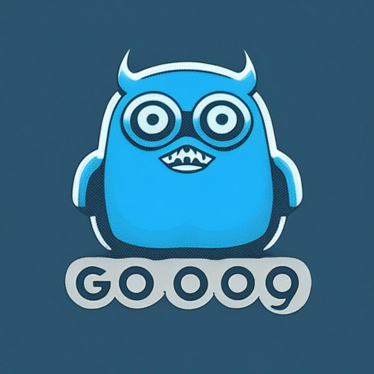

# Hey there! And Welcome to the my Telegram Bot's personal page.
## It's simple Telegram bot made just for fun &amp; used for practice :smile:
  <a href=https://t.me/dGhlX21vc3RfdG9sZXJhbnRfYm90_bot> </a>

### You can try my bot [here](https://t.me/dGhlX21vc3RfdG9sZXJhbnRfYm90_bot)
 
<a href="https://t.me/dGhlX21vc3RfdG9sZXJhbnRfYm90_bot">
  
</a>

+ As the developer of this bot's code, I've customized it to fit my personal preferences and interests. Using the Telegram Bot API and GO programming language, I've equipped my bot with all sorts of fun and useful features.
+  I do not intend to offend or harm anyone. The use of this code remains at your own conscience and under your responsibility. 
Peace for everyone :blue_heart:
___
 Building and customizing my Telegram bot has been incredibly educational and rewarding. I've improved my knowledge of GO programming language, sharpened my technical skills, and honed my problem-solving abilities.
Basically I used the following technologies and packages:
```
github.com/golang/go
github.com/go-telegram-bot-api/telegram-bot-api
Default packages: "fmt", "encoding/json", "net/http", "io", "time", "math/rand" 
```
___
Main bot's features:
+ Get actual BTC/USD, USD/RUB and EUR/RUB rate :money_with_wings:
+ Get info about sharing free games in Epic Games :video_game:
+ Get random gif for answer yes/no/maybe or just get random gif :cactus:
+ Get randomly generated insult for somebody :goberserk:
+ Generator of future events forecast with crazy facts and especial people :trollface:
+ Advisor "what should you do on your day off" :beers:
___
If for some reason you decide to use this code :smile: then for your own bot based on this code you need to:
1. Install GO and setup GO environment;
2. Clone this repo to your local machine;
3. Create new bot in [BotFather](https://t.me/BotFather);
4. Get a unique token for your new bot from BotFather;
5. Insert token into */telega/telegabot.go* instead of **TgBotToken** variable in **TelegramBot** function;
6. Launch main.go
7. Voila, enjoy the result.

   


___
Goals and TODO
- [x] Create main structure
- [x] Add some APIs
- [ ] Customize existing Funcs for make it more flexible
- [ ] Add supporting for work with inline mode
- [ ] Add supporting for work with buttons
- [ ] Rework the user's primary usage path

